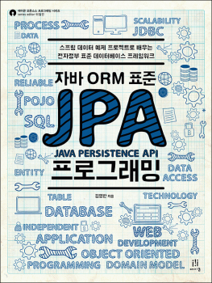

# 자바 ORM 표준 JPA 프로그래밍 [스프링 데이터 예제 프로젝트로 배우는 전자정부 표준 데이터베이스 프레임워크]

[소스파일](https://github.com/holyeye/jpabook)

## 요약
자바 ORM 표준 JPA는 SQL 작성 없이 객체를 데이터베이스에 직접 저장할 수 있게 도와주고, 객체와 관계형 데이터베이스의 차이도 중간에서 해결해준다. 이 책은 JPA 기초 이론과 핵심 원리, 그리고 실무에 필요한 성능 최적화 방법까지 JPA에 대한 모든 것을 다룬다. 또한, 스프링 프레임워크와 JPA를 함께 사용하는 방법을 설명하고, 스프링 데이터 JPA, QueryDSL 같은 혁신적인 오픈 소스를 활용해서 자바 웹 애플리케이션을 효과적으로 개발하는 방법을 다룬다.

## 이 책에서 다루는 내용
- JPA 기초 이론과 핵심 원리
- JPA로 도메인 모델을 설계하는 과정을 예제 중심으로 설명
- 다양한 객체 지향 쿼리 언어 설명
- JPA와 스프링 프레임워크를 함께 사용해서 웹 애플리케이션을 개발하는 방법
- 스프링 데이터 JPA, QueryDSL 소개 및 활용
- 실무에서 JPA를 사용할 때 성능을 최적화하는 다양한 방법

## 구성
JPA는 크게 객체와 테이블을 어떻게 매핑해야 하는지에 관한 설계 부분과 설계한 모델을 실제 사용하는 부분으로 나눌 수 있다. 책의 앞부분에서는 기초 이론과 설계 방법을 학습하고 뒷부분에서는 학습한 이론을 바탕으로 JPA를 활용해서 실제 웹 애플리케이션을 개발한다.

이 책은 크게 네 부분으로 나뉘어 있다.

1장에서 9장은 이론 편이다. 객체와 테이블을 매핑하는 방법과 JPA의 핵심 기능들을 알아본다. 4장부터 9장까지는 각 장의 마지막에 점진적으로 도메인 모델을 설계해 나가는 실전 예제가 있어서 학습한 내용을 실제로 적용해볼 수 있게 했다.
10장은 객체지향 쿼리 언어에 대한 내용이다. JPA가 제공하는 객체지향 쿼리 언어인 JPQL(Java Persistence Query Language)부터 직접 SQL을 작성하는 네이티브 SQL까지 알아본다.
11장과 12장은 실무에서 JPA를 사용하기 위한 활용편이다. 스프링 프레임워크와 JPA를 사용해서 어떻게 웹 애플리케이션을 개발하는지 학습하고 스프링 데이터 JPA와 QueryDSL이라는 혁신적인 오픈소스도 사용해본다.
13장에서 16장은 트랜잭션과 락, 캐시, 성능 최적화 등 JPA의 다양한 고급 주제들을 다룬다.