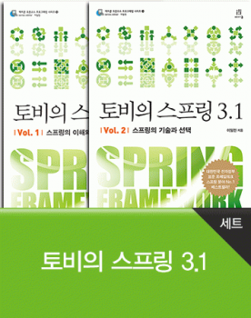

# 토비의 스프링 3.1 세트

[소스파일](https://github.com/AcornPublishing/toby-spring3-1-set)

## 요약
『토비의 스프링 3.1』은 스프링을 처음 접하거나 스프링을 경험했지만 스프링이 어렵게 느껴지는 개발자부터 스프링을 활용한 아키텍처를 설계하고 프레임워크를 개발하려고 하는 아키텍트에 이르기까지 모두 참고할 수 있는 스프링 완벽 바이블이다.

대한민국 전자정부 표준 프레임워크 스프링을 설명하는 No. 1 베스트셀러!

## Vol. 1 스프링의 이해와 원리
단순한 예제를 스프링 3.0과 스프링 3.1의 기술을 적용하며 발전시켜 나가는 과정을 통해 스프링의 핵심 프로그래밍 모델인 IoC/DI, PSA, AOP의 원리와 이에 적용된 다양한 디자인 패턴, 프로그래밍 기법을 이해할 수 있도록 도와준다. 이어지는 《Vol. 2 스프링의 기술과 선택》에서 상세히 소개하는 스프링 3.0과 스프링 3.1의 방대한 기술을 쉽게 이해하고 효과적으로 응용하는 데 필요한 기반 지식을 쌓도록 도와준다.

## Vol. 2 스프링의 기술과 선택
XML 대신 자바코드를 이용해서 스프링을 개발할 수 있는 최신 빈 설정 기법부터 편리한 RESTful 스타일의 웹 컨트롤러 작성 기법까지 스프링 3.0과 스프링 3.1의 최신 기술을 상세하게 소개하고 그 중에서 자신에게 맞는 최적의 기술을 선택하고 조합할 수 있는 기준과 활용전략을 다룬다.

## 이 책의 구성
스프링이 공개된 지 이미 9년째이고 많은 개발자가 스프링을 사용해 애플리케이션을 개발해오고 있다. 그럼에도 적지 않은 수의 개발자들은 스프링의 핵심 가치와 혜택을 충분히 누리지 못하는 듯하다. 스프링의 가치를 제대로 누리며 사용하려면 스프링을 제대로 공부해야 한다. 스프링을 효과적으로 익히려면 다음의 세 가지 단계를 통해 스프링을 학습해야 한다.

▶ 스프링의 핵심 가치와 원리에 대한 이해 
▶ 스프링의 기술에 대한 지식과 선택 기준 정립 
▶ 스프링의 적용과 확장 

이 책은 이 세 가지 단계를 따라서 스프링을 공부하려는 사람을 대상으로 쓰여진 책으로, Vol. 1에서는 첫 단계인 ‘핵심 가치와 원리에 대한 이해’를 중심으로 하고, Vol. 2에서는 두 번째 단계인 ‘스프링 기술에 대한 지식과 선택’을 집중해서 다룬다. 세 번째 단계인 확장에 대해서는 책의 여러 곳에서 다양한 전략과 예제, 힌트를 제공한다. 하지만 본격적으로 응용과 확장에 대한 지식을 쌓는 일은 독자들의 몫이다. 각자의 상황에 맞게 처음 두 단계에서 배운 지식을 응용해 스프링을 확장해보는 훈련을 해야 한다.

## 스프링 3.1의 새로운 기능
스프링 3.1에 추가된 주요한 기능과 특징은 다음과 같다.

### 강화된 자바 코드를 이용한 빈 설정
스프링 3.1은 스프링 3.0부터 지원하기 시작한 자바 코드를 이용한 빈 설정 방식을 대폭 확장해서 스프링 빈 설정의 거의 모든 영역으로 확대했다. 기존에 XML로 작성했던 스프링 설정 정보를 3.1에서는 자바 코드로 대체할 수 있다. XML을 전혀 사용하지 않고 스프링 애플리케이션을 작성할 수도 있다. 자바 코드를 이용한 빈 설정을 위해 다양한 애노테이션이 추가됐다. XML의 전용 커스텀 태그를 대체할 수 있는, @Enable로 시작하는 전용 애노테이션도 제공된다.

### 런타임 환경 추상화
스프링 애플리케이션이 실행되는 런타임 환경 정보를 추상화한 환경 오브젝트가 컨테이너를 통해 제공된다. 실행환경에 따라 달라지는 빈 설정을 효과적으로 관리할 수 있는 프로파일과 각종 프로퍼티 정보를 컨테이너를 통해 일관된 방식으로 제공할 수 있게 해주는 프로퍼티 소스가 환경 오브젝트가 제공하는 주요 기능이다.

### JPA 지원 확장과 하이버네이트 4 지원
하이버네이트 4 지원 기능이 새롭게 추가됐다. JPA를 이용할 때보다 편리하게 설정정보를 작성할 수 있는 편리한 기능도 추가됐다.

### 새로운 DispatcherServlet 전략과 플래시 맵
스프링 3.0에서 사용되던 DispatcherServlet 전략의 일부가 새롭게 설계된 전략으로 대체됐다. 이를 통해 MVC 기능을 확장하기가 편리해졌다. Post/Redirect/Get 패턴에 사용할 수 있는 플래시 맵 기능도 추가됐다.

### 캐시 추상화
AOP를 이용한 메소드 레벨의 캐시 추상화 기능이 추가됐다. 이를 이용해 캐시 구현 기술에 독립적인 방식으로 애플리케이션 빈에 캐시 기능을 적용할 수 있게 됐다. 맵을 이용한 간단한 캐시 구현부터 ehcache를 이용한 고급 캐시 기술까지 지원한다.

