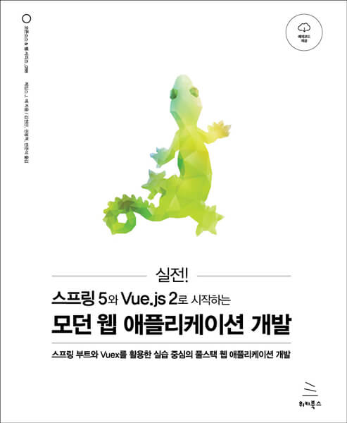

# 실전! 스프링 5와 Vue.js 2로 시작하는 모던 웹 애플리케이션 개발

🌟 이 책에서 다루는 내용 🌟

- Vue, Vuex, 스프링 부트로 애플리케이션의 프런트엔드와 백엔드 연결하기
- 최신 웹 표준을 활용해 코드 성능과 가독성, 상호 호환성 향상시키기
- 스프링 시큐리티로 안전한 풀스택 웹 애플리케이션 구축하기
- 요구 사항 분석 및 데이터 모델 설계하기
- Vue.js 2와 스프링 5로 싱글 페이지 애플리케이션 개발하기
- 개념적, 논리적, 물리적 데이터 모델링 연습
- RESTful API의 설계와 구현, 보안, 테스트
- 애플리케이션의 신뢰도를 향상시키기 위한 테스트 케이스 추가하기
- 애플리케이션을 프로덕션 환경에 배포하고 모니터링하기

[코드](https://wikibook.co.kr/spring-vuejs/)
[코드 깃허브](https://github.com/wikibook/spring-vuejs)